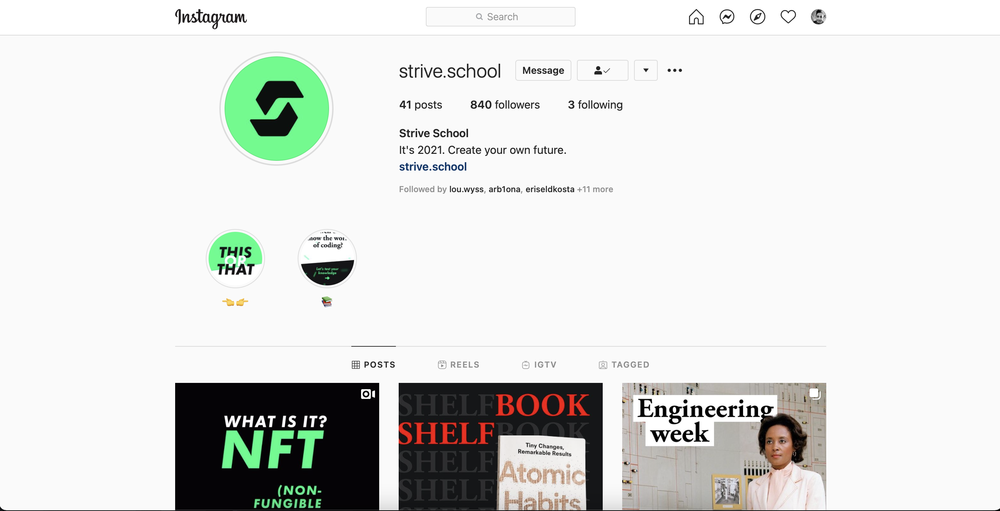

We love instagram, its an app that we use to share best moments in our life!

But it doesnt have image upload feature on web , lets make it!

Here are the features to implement:

## Users

- user should register and login with email password or oauth.
- user should be able to edit their profile details, such as avatar, username (only their own data)
- user profile should contain previous posts.

## Posts

- user should be able to add/delete posts to the feed (user can edit & delete only their own data).
- it should be possible to comment on post. (user can delete and edit only his own comments).
- it should be possible to like/unlike post.
- it should be possible to see the list of users who liked the post.

## [EXTRA] Connections

- user should be able to follow/unfollow other users
- user should be able to see posts of the users he is following

## [EXTRA] Chat

- user should be able to see/delete previous chats (they can see & delete only their own data).
- user should be able to search other users to start chat with by username.
- implement private 1on1 chat.
- implement messages that will disappear after 24 hours

** arent these enough for you ? **

## [EXTRA] Stories

- Add stories feature to upload videos (max 10 sec) or photos to your stories

Tips :

 - Use cloudinary to serve images

Deploy the project, show everyone how skilled you are!

