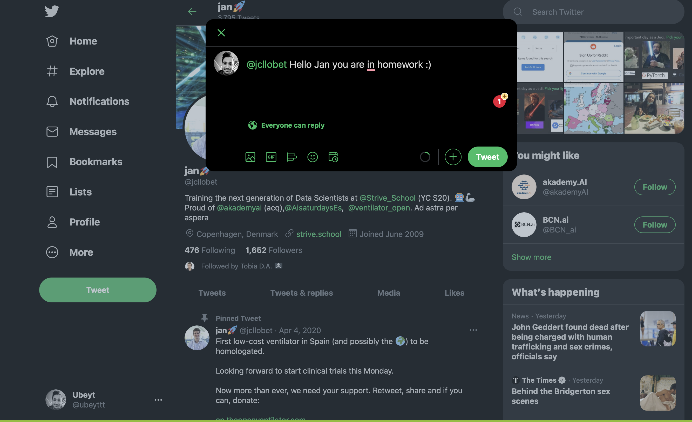
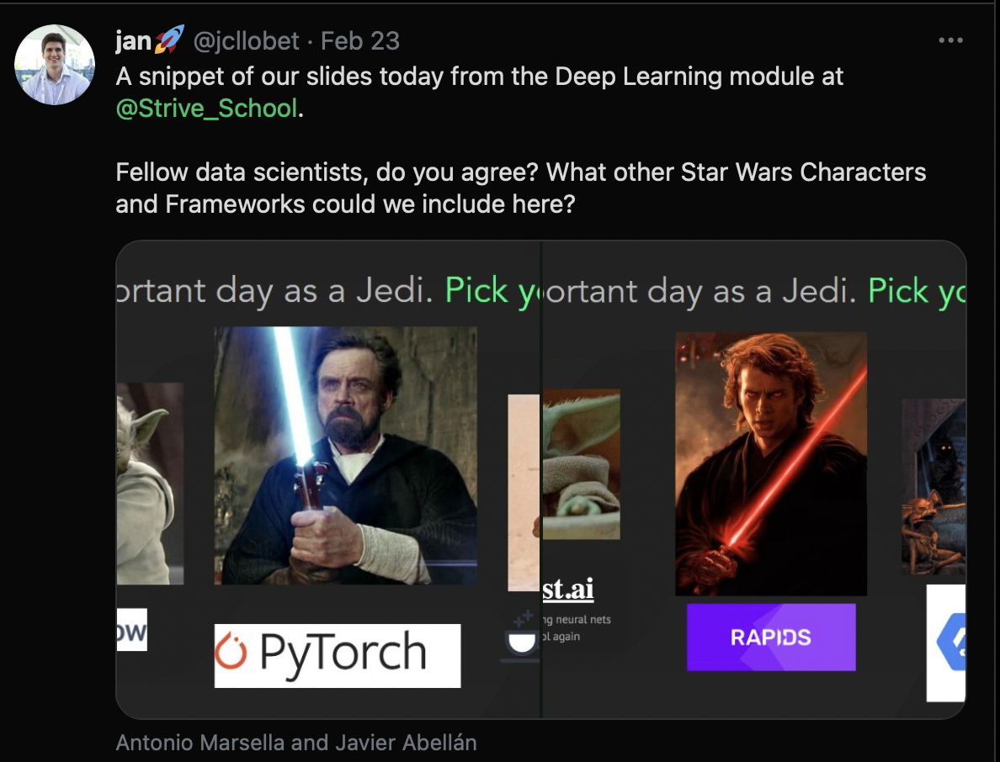
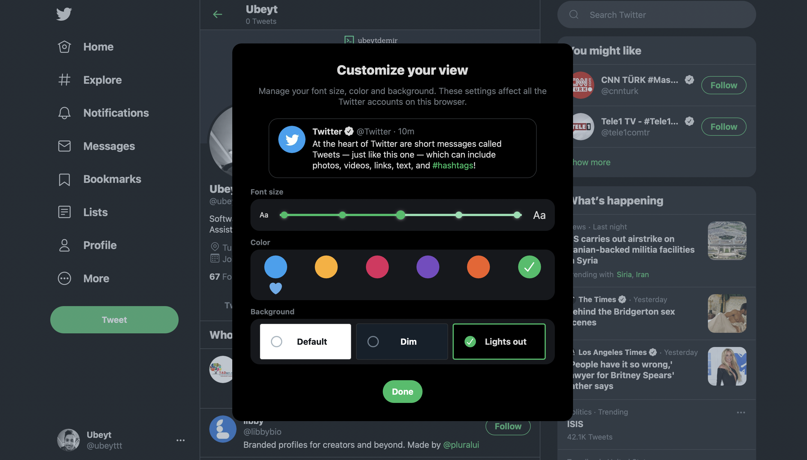
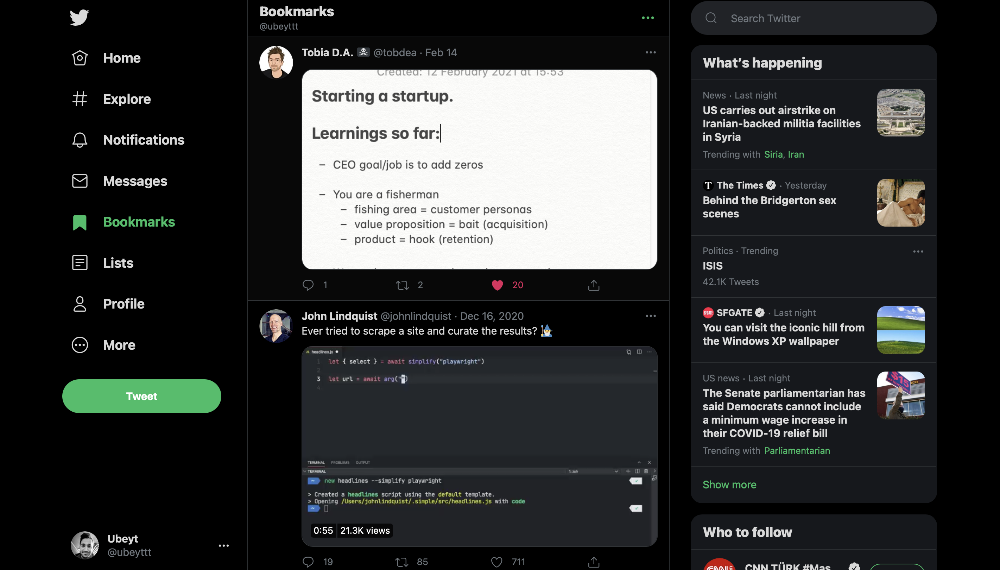
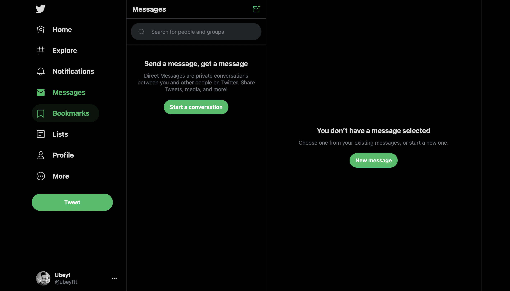
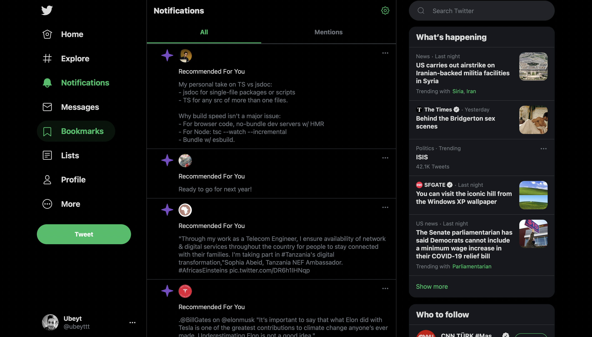
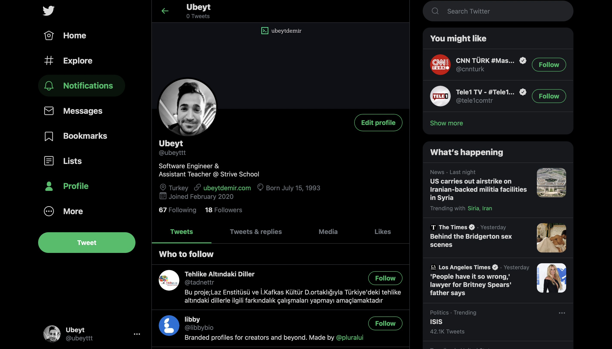
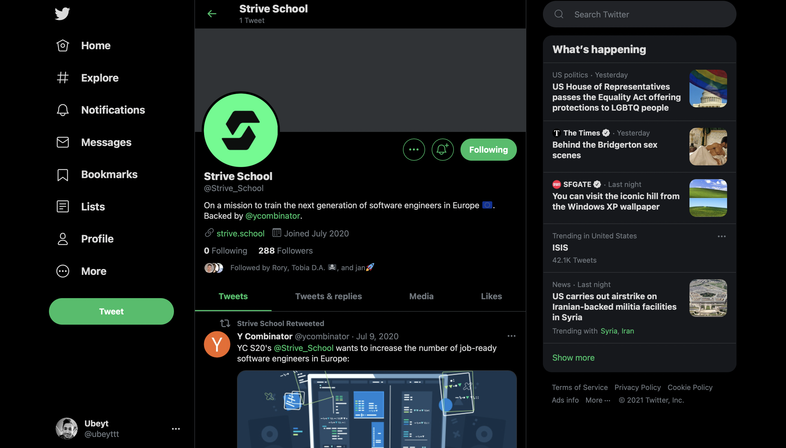

We all love twitter. 

Its widely used social media platform to share ideas.

Would you like to have a clone of it on your portfolio?

Its your last build week as team.

We'll be covering frontend, backend, authentication, real-time in this project.

Here are  the features to implement.

## Tweets

- Each tweet must be 280 chars, no more.
- Author of the tweet should be releated with user collection by id.
- A tweet can contain text,media (image, gif, video) or both.
- Other users should be able comment, like.
-  Only author of the user should be able to edit tweet.
- [Extra] If tweet is edited show that in timeline as tweet status "edited"
- [Extra] Retweet. In retweet actual tweet owner should be visible.
- [Super Extra] Each tweet should have "pre" and "next" field so we can create threads.

## Users

- Users should login/register to app.
- Users should be able to login via oauth (choose a provider you like.)
- Users should be able to upload their profile,avatar, and profile cover.
- Each user should have profile, other users should be able to visit and search profiles.
- [Extra] Implement follow/unfollow feature

## Feed

- If you have follow structure show only followed users tweets i
- else show everyones tweets in feed.

## Bookmarks

- Users should be able to add bookmarks (fav tweets)
- And show bookmarked tweets in a page.

**Arent these enough for you ?**

Do you like more backend?

## [Extra] Notifications

- Implement notification feature with socket.io
- Notifications to implement:
	- Mentions: when a tweet contains your username 
	- Reactions: If someone comment/likes/retweets your tweet 

Do you like more frontend? 

## [Extra] Theming

- Allow users to change theme of your app

