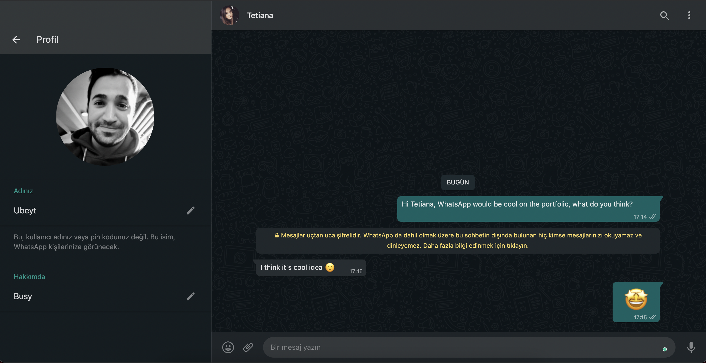
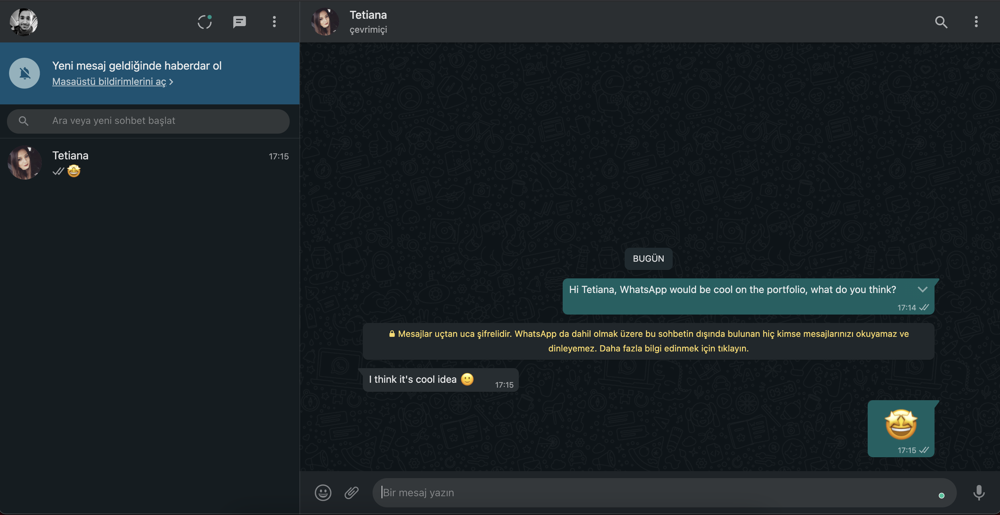

> We all use WhatsApp daily to talk with friends and family.
> Did you like real-time programming with socket.io? we also like it its super cool, isn't it?
> We think whatsapp would be a good fit to your portfolio!
> It's your last build week. You will create both backend and frontend from scratch

Here are the features to implement:

## Users

- user should register and login with email password or oauth.
- user should be able to edit their profile details, such as avatar, status, username (only their own data)

## Chat

- User should be able to see/delete previous chats (they can see & delete only their own data)
- User should be able to search other users to start chat with by username
- Implement private 1on1 chat
- Chat can contain text, media (photo only) or both.
- User should be able to add emoji to messages. (we can't think whatsapp without emojis, right?)
- Implement a group chat.
- [EXTRA] user should be able to send a private message to a specific user in a group chat
- [EXTRA] implement the possibility of sending attachments as a message
- [EXTRA] Change chat background image.

Tips :

- Use [react-chat-elements](https://www.npmjs.com/package/react-chat-elements), it has whatsapp look&feel components.

## Idle

- Is user on message page ? then he/she is active emit an event!
- Is user typing ?  you have onKeyDown onKeyUp events on js, emit an event and let other parts know that user is typing.

Deploy the project, show everyone how skilled you are!

